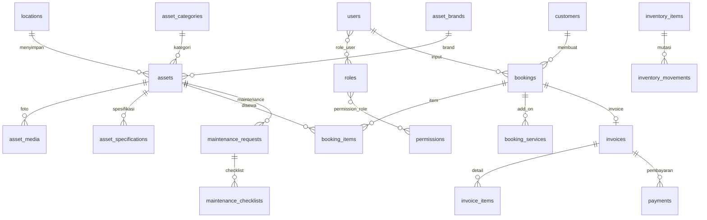

# 03 — Skema Database MySQL

## Tabel Inti

1. users
2. roles
3. permissions
4. role_user
5. permission_role
6. locations
7. asset_categories
8. asset_brands
9. assets
10. asset_media
11. asset_specifications
12. asset_kits
13. asset_kit_items
14. customers
15. bookings
16. booking_items
17. booking_services
18. invoices
19. invoice_items
20. payments
21. maintenance_requests
22. maintenance_checklists
23. inventory_items
24. inventory_movements
25. activity_logs
26. settings

## ERD Mermaid



## Field Penting: assets

| Field | Tipe | Keterangan |
|---|---|---|
| asset_code | string unique | Kode aset, contoh AST-CAM-0001 |
| category_id | foreignId | Kategori |
| brand_id | foreignId nullable | Brand |
| location_id | foreignId | Lokasi |
| name | string | Nama aset |
| serial_number | string nullable | Serial number |
| daily_rate | decimal | Tarif harian |
| deposit_amount | decimal | Deposit |
| replacement_value | decimal nullable | Nilai penggantian |
| condition_status | string | excellent, good, fair, damaged |
| availability_status | string | available, rented, reserved, maintenance, retired |
| shelf_position | string nullable | Rak/posisi |
| qr_code | string nullable | Path QR |
| barcode | string nullable | Barcode |
| is_active | boolean | Status aktif |

## Field Penting: bookings

| Field | Tipe | Keterangan |
|---|---|---|
| booking_code | string unique | Kode booking |
| customer_id | foreignId | Customer |
| user_id | foreignId | Pembuat |
| pickup_at | datetime | Jadwal pickup |
| return_at | datetime | Jadwal kembali |
| delivery_method | string | pickup/delivery |
| status | string | draft, pending, approved, active, completed, cancelled, overdue |
| subtotal, discount_amount, insurance_amount, delivery_fee, tax_amount, deposit_amount, grand_total | decimal | Kalkulasi biaya |

## Rule Anti Double Booking

```sql
existing.pickup_at < requested_return_at
AND existing.return_at > requested_pickup_at
```

Final check wajib dilakukan ulang di `BookingService::createBooking()` memakai `DB::transaction()` dan `lockForUpdate()`.
